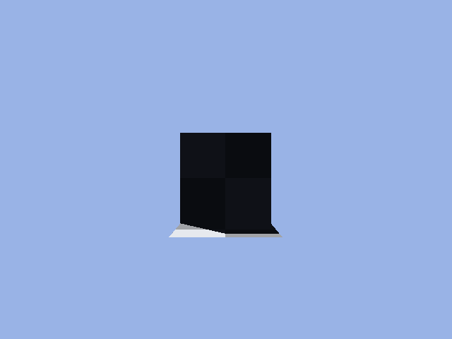

# raytracer
Triangle raytraced rendering engine written in Haskell.

## current state

## plans
Below are un-edited notes from a car ride where I had the idea to make this. Enjoy.

Planned features:
- diffuse shaders
- glossy shaders (with variable roughness)
- emmisive shaders
- refractive shaders (diffraction too?) 
-?pbr shaders
- point lights
- sun lights
- soft shadows (light is a sphere) 
- hard shadows (light is a point) 
- environment textures (procedural skies too?)
- textures on polygons
- file format to describe scene setups
- renders to different image formats
- multicore rendering (should be easy to do in haskell)
- depth of field
- lens distortion
-?mix in csg objects into polygon scenes? maybe

far future stuff:
- basic animation and video/image sequence rendering
- 3d textures/volumetrics
- denoising
- subsurface shaders
- shader graph
- blend file reading

file format:
- can specify lights
- can define objects that have meshes and shaders
- objects can be translated, scaled, and rotated 
- can define shaders in a special format or maybe in mtl files
- can define meshes by linking .obj files

shaders:
- will be linked to other objects that produce different values. this is to make transition to nodes easier when that happens and to make having textures vs. solid colors easier.
- each type of value in the graph will have its own algebraic data type, and each subtype is a specific version
- eg. brdf type will have diffuse, glossy, refractive, emmisive, constant; color type has texture, constant; vector2 type has texturecoordinate, constant; vector3 has hitpos, constant; and so on
- something like diffuse will have a space for a color type, so you can create a `Diffuse $ ConstantCol 255 0 0` to make a solid red shader

state monad will be used for rendering to keep track of scene information and the random seed

## progress over time
Time-ordered series of images as the raytracer has new features added.
| Date | Image |
|:-:|:-:|
| 12/30/2019 |  |
